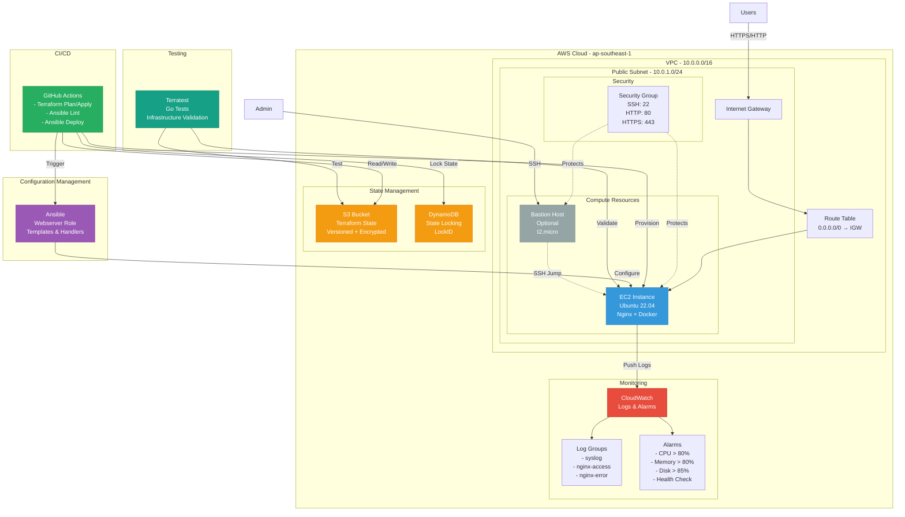

# Cloud Infrastructure Architecture

## Architecture Diagram

## Architecture Components

### 1. Networking Layer
- **VPC**: 10.0.0.0/16 CIDR block
- **Public Subnet**: 10.0.1.0/24 for internet-accessible resources
- **Internet Gateway**: Provides internet connectivity
- **Route Table**: Routes traffic to internet via IGW

### 2. Compute Layer
- **EC2 Instances**: Application servers with auto-configured web stack
  - Ubuntu 22.04 LTS
  - Nginx web server
  - Docker runtime
  - CloudWatch agent
- **Bastion Host** (Optional): Secure SSH access point
  - Minimal t2.micro instance
  - Jump host for private instances

### 3. Security Layer
- **Security Groups**: Stateful firewall rules
  - Port 22 (SSH): Administration access
  - Port 80 (HTTP): Web traffic
  - Port 443 (HTTPS): Secure web traffic
- **Encrypted Storage**: EBS volumes with encryption enabled
- **IAM Roles**: CloudWatch agent permissions

### 4. Monitoring & Observability
- **CloudWatch Logs**:
  - System logs (syslog)
  - Nginx access logs
  - Nginx error logs
- **CloudWatch Alarms**:
  - High CPU utilization (> 80%)
  - High memory usage (> 80%)
  - Disk space critical (> 85%)
  - Instance health check failures

### 5. State Management
- **S3 Backend**: Centralized Terraform state storage
  - Versioning enabled
  - Server-side encryption
  - Per-environment state files
- **DynamoDB**: State locking mechanism
  - Prevents concurrent modifications
  - Pay-per-request billing

### 6. Configuration Management
- **Ansible**: Automated configuration
  - Role-based structure
  - Environment-specific variables
  - Jinja2 templates
  - Service handlers

### 7. CI/CD Pipeline
- **GitHub Actions**:
  - Automated validation
  - Terraform planning and deployment
  - Ansible linting and execution
  - Caching for performance
  - PR plan comments

### 8. Testing Framework
- **Terratest**: Infrastructure validation
  - Go-based testing
  - VPC validation
  - EC2 instance checks
  - Security group verification
  - Web server health checks

## Data Flow

1. **Deployment Flow**:
   - Developer pushes code → GitHub Actions triggered
   - Terraform validates configuration
   - Terraform plans infrastructure changes
   - Manual approval (production)
   - Terraform applies changes
   - Ansible configures instances
   - Monitoring activated

2. **Traffic Flow**:
   - User request → Internet Gateway
   - Route table forwards to EC2
   - Security group validates
   - Nginx handles request
   - Response returned to user

3. **Monitoring Flow**:
   - EC2 generates logs
   - CloudWatch agent ships logs
   - Alarms evaluate metrics
   - Notifications on threshold breach

4. **Admin Access Flow**:
   - Admin connects to Bastion
   - SSH jump to target EC2
   - Secure administration

## Environment Strategy

| Environment | Instance Type | Monitoring | Bastion | Purpose |
|-------------|---------------|------------|---------|---------|
| Dev | t2.micro | Optional | No | Development testing |
| Staging | t3.micro | Enabled | Optional | Pre-production validation |
| Production | t3.medium | Enabled | Enabled | Live workloads |

## High Availability Considerations

Current architecture is single-AZ. For production HA:
- Deploy across multiple Availability Zones
- Implement Auto Scaling Groups
- Add Application Load Balancer
- Use RDS Multi-AZ for databases
- Implement backup and disaster recovery

## Cost Optimization

- Right-sizing instances per environment
- S3 lifecycle policies for old state files
- CloudWatch log retention policies
- Pay-per-request DynamoDB billing
- Scheduled stop/start for dev environments

## Security Best Practices

✅ Implemented:
- Encrypted EBS volumes
- Security groups with minimal ports
- IAM roles instead of access keys
- State file encryption
- Optional bastion for SSH access

🔄 Recommended additions:
- VPC Flow Logs
- AWS Systems Manager Session Manager
- Secrets Manager for sensitive data
- WAF for web application firewall
- GuardDuty for threat detection
